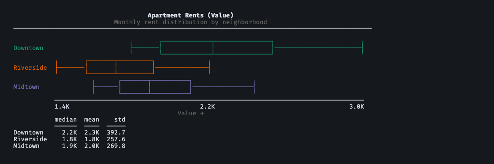

# textcharts

Beautiful text based charts for your terminal — zero dependencies.

15 chart types with Unicode box-drawing, ANSI colors, and automatic terminal
width detection. Pure Python, no external dependencies, Python 3.10+.

## Provenance

`textcharts` was extracted from the
[BenchBox](https://github.com/joeharris76/benchbox) project so the terminal
charting layer could be used as a standalone library.

BenchBox remains the source of the most complete end-to-end usage examples for
benchmarking and performance-analysis workflows. For canonical example-driven
documentation, see the
[BenchBox documentation](https://benchbox.dev/docs/index.html).

## Install

```bash
pip install textcharts
```

## Quick Start

```python
from textcharts import BoxPlot, BoxPlotSeries

downtown = [1825, 1900, 1980, 2100, 2250, 2400, 2550, 2710, 2980]
riverside = [1450, 1525, 1600, 1680, 1750, 1820, 1950, 2080, 2220]
midtown = [1650, 1710, 1780, 1840, 1920, 2010, 2140, 2280, 2450]

series = [
    BoxPlotSeries(name="Downtown", values=downtown),
    BoxPlotSeries(name="Riverside", values=riverside),
    BoxPlotSeries(name="Midtown", values=midtown),
]
chart = BoxPlot(
    series=series,
    title="Apartment Rents",
    subtitle="Monthly rent distribution by neighborhood",
)
print(chart.render())
```



<details>
<summary>Text output (greyscale)</summary>

```
Apartment Rents (Value)
               Monthly rent distribution by neighborhood
────────────────────────────────────────────────────────────────────────

                         ╷     ┌─────────┬──────────┐                ╷
Downtown                 ├─────│         │          │────────────────┤
                         ╵     └─────────┴──────────┘                ╵
           ╷    ┌─────┬──────┐          ╷
Riverside  ├────│     │      │──────────┤
           ╵    └─────┴──────┘          ╵
                  ╷    ┌────┬────────┐          ╷
Midtown           ├────│    │        │──────────┤
                  ╵    └────┴────────┘          ╵
           ───────────────────────────────────────────────────────────
           1.4K                       2.2K                        3.0K
                                Value →
           median  mean    std
           ──────  ────  ─────
Downtown     2.2K  2.3K  392.7
Riverside    1.8K  1.8K  257.6
Midtown      1.9K  2.0K  269.8
```

</details>

## Chart Types

| Chart              | Class               | Data Model           |
| ------------------ | ------------------- | -------------------- |
| Bar chart          | `BarChart`          | `BarData`            |
| Histogram          | `Histogram`         | `HistogramBar`       |
| Heatmap            | `Heatmap`           | matrix + labels      |
| Box plot           | `BoxPlot`           | `BoxPlotSeries`      |
| Line chart         | `LineChart`         | `LinePoint`          |
| Scatter plot       | `ScatterPlot`       | `ScatterPoint`       |
| Comparison bar     | `ComparisonBar`     | `ComparisonBarData`  |
| Diverging bar      | `DivergingBar`      | `DivergingBarData`   |
| Summary box        | `SummaryBox`        | `SummaryStats`       |
| Percentile ladder  | `PercentileLadder`  | `PercentileData`     |
| Normalized speedup | `NormalizedSpeedup` | `SpeedupData`        |
| Stacked bar        | `StackedBar`        | `StackedBarData`     |
| Sparkline table    | `SparklineTable`    | `SparklineTableData` |
| CDF chart          | `CDFChart`          | `CDFSeriesData`      |
| Rank table         | `RankTable`         | `RankTableData`      |

## Public API

- Chart classes: `BarChart`, `Heatmap`, `LineChart`, `SummaryBox`, etc.
- Data models: `BarData`, `HistogramBar`, `LinePoint`, `SummaryStats`, etc.
- Configuration: `ChartOptions` and `ColorMode`

## CLI

Generate charts from the command line with JSON input:

```bash
# Pipe JSON data to any chart type
echo '[{"label": "Fiction", "value": 18.4}, {"label": "Comics", "value": 9.8}]' \
  | textcharts bar --title "Revenue" --no-color

# Read from a file
textcharts heatmap -f matrix.json --color-scheme sequential

# List all 15 chart types
textcharts list

# See data format and options for any chart type
textcharts scatter --help
```

See the [input formats reference](https://joeharris76.github.io/textcharts/latest/input-formats.html) for the JSON schema of each
chart type.

## MCP Server

Use textcharts as an AI tool via the
[Model Context Protocol](https://modelcontextprotocol.io):

```bash
pip install textcharts[mcp]
```

Add to your MCP client config (Claude Desktop, Claude Code, etc.):

```json
{
  "mcpServers": {
    "textcharts": {
      "command": "textcharts-mcp"
    }
  }
}
```

This exposes 17 tools: `textcharts_bar`, `textcharts_heatmap`, ...,
`textcharts_list`, and `textcharts_describe`. See
the [MCP setup guide](https://joeharris76.github.io/textcharts/latest/mcp-setup.html) for full configuration options.

## Configuration

```python
from textcharts import ChartOptions, ColorMode

opts = ChartOptions(
    use_color=True,       # Auto-detect ANSI color support; set False to force plain text
    use_unicode=True,     # Unicode box-drawing characters
    width=80,             # Chart width (None for auto-detect)
    theme="dark",         # "dark" or "light"
)
```

`use_color=True` respects terminal detection and `NO_COLOR`. In non-interactive
contexts, renders default to plain text without ANSI escapes.

Heatmaps support `color_scheme="diverging"` (default) or
`color_scheme="sequential"`.

Matrix-based APIs require exact dimensions:
- `len(row_labels) == len(matrix)`
- every matrix row length must equal `len(col_labels)`

## Development

Install dev tools:

```bash
uv sync --group dev
```

Run the same checks used for release verification:

```bash
uv run --group dev ruff check src/ tests/
uv run --group dev python -m pytest -q
uv run --group dev sphinx-build -W -b html docs docs/_build/html
uv build
```

Project documentation lives under `docs/` and is built with Sphinx.

If you want richer real-world examples beyond the standalone library docs, use
the [BenchBox documentation](https://benchbox.dev/docs/index.html) as the
canonical reference for benchmark-oriented chart usage.

Golden regression snapshots live under `tests/fixtures/golden/ascii/`. To
intentionally update them after a renderer change:

```bash
uv run --group dev python -m pytest tests/test_golden_output.py -q --update-golden
```

## Features

- **Zero dependencies** — pure Python, stdlib only
- **15 chart types** — from simple bars to heatmaps and CDF curves
- **Terminal-aware** — auto-detects width, color support, and Unicode capability
- **Best/worst highlighting** — automatic annotation of extreme values
- **Typed** — full type hints with `py.typed` marker (PEP 561)

## License

MIT
